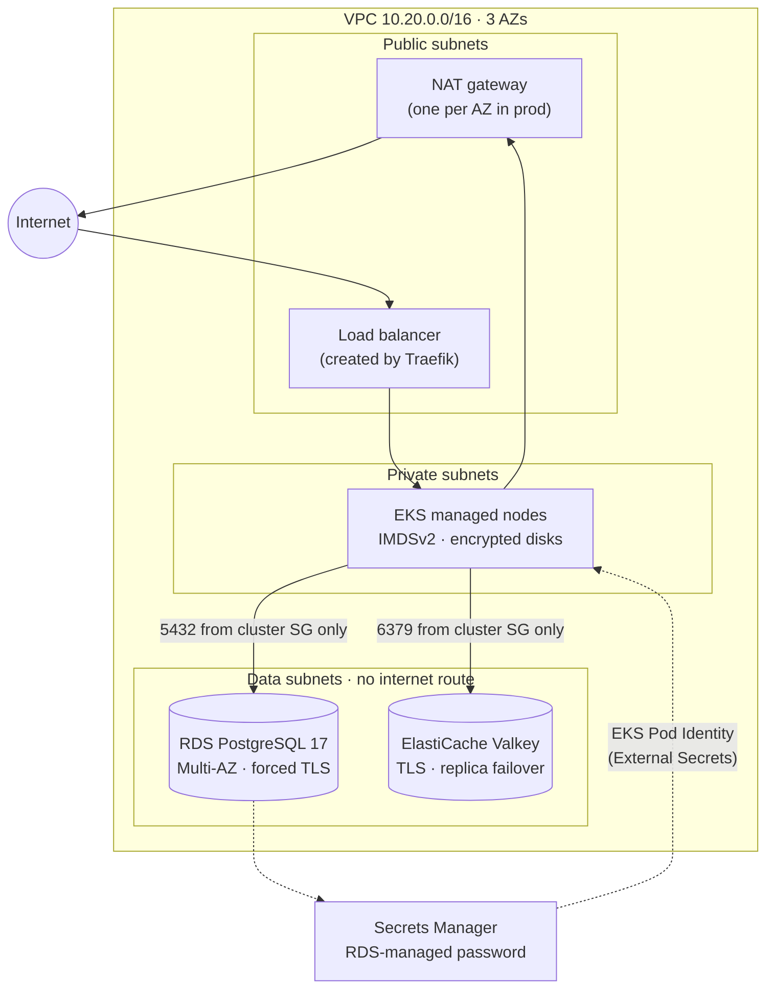

# terraform-aws-platform

[](https://github.com/Salar24/terraform-aws-platform/actions/workflows/ci.yml)


AWS infrastructure for [**ratelimited-api**](https://github.com/Salar24/ratelimited-api), written in Terraform with every module built from scratch: a three-tier VPC, a hardened EKS cluster, RDS PostgreSQL, ElastiCache (Valkey), and keyless CI access to AWS through GitHub OIDC.

It's the third layer of one system:

| Repo | Layer |
|---|---|
| [ratelimited-api](https://github.com/Salar24/ratelimited-api) | Go service and container image |
| [k8s-platform](https://github.com/Salar24/k8s-platform) | Helm chart and ArgoCD GitOps |
| **terraform-aws-platform** | The cloud infrastructure it all runs on |

The `redis_url` and database secret this repo outputs are the values k8s-platform's **prod** environment expects.

## Architecture



## What's in it

| Module | Highlights |
|---|---|
| [`network`](modules/network) | Public, private and **isolated data subnets** in each AZ. NAT **per AZ** (prod) or shared (dev). Kubernetes load-balancer subnet tags. VPC flow logs. The default security group is locked down. |
| [`eks`](modules/eks) | **Private API endpoint by default**, and a validation rule refuses `0.0.0.0/0`. Access entries instead of `aws-auth`. KMS envelope encryption of Secrets. Audit logs. Nodes require **IMDSv2 with hop limit 1**, so pods can't borrow the node's IAM role. **VPC CNI NetworkPolicy enforcement**, which the k8s-platform chart relies on. EKS Pod Identity. |
| [`database`](modules/database) | PostgreSQL 17 in data subnets. **The password is generated and rotated by RDS in Secrets Manager** and never enters Terraform state. `rds.force_ssl`. Storage autoscaling, Performance Insights, IAM auth. Multi-AZ, deletion protection and final-snapshot toggles. |
| [`cache`](modules/cache) | Valkey 8 (the Redis-compatible engine), encrypted in transit and at rest. Automatic failover and Multi-AZ switch on as soon as there's a replica. |
| [`pod-identity`](modules/pod-identity) | Binds an IAM role to one Kubernetes service account. Used to let External Secrets read **only** this environment's DB secret. |
| [`platform`](modules/platform) | Composes the modules above into one environment. |
| [`bootstrap`](bootstrap) | State bucket (versioned, **customer-managed KMS key**, TLS-only, S3-native locking) and **GitHub OIDC roles**: read-only *plan* for any branch, *apply* only from approved GitHub Environments. |

### Dev vs prod

| | dev | prod |
|---|---|---|
| NAT gateways | 1 shared | 1 per AZ |
| Nodes | 2–3 × t3.medium **Spot** | 3–9 × m6i.large on-demand |
| Postgres | db.t4g.micro, single-AZ, 1-day backups, no deletion protection | db.m6g.large, **Multi-AZ**, 14-day backups, **deletion protection** |
| Valkey | 1 node | primary + replica, **automatic failover** |
| Log retention | 7 days | 90 days |

Dev's cost is dominated by the EKS control plane and the NAT gateway. It runs at roughly **$150/month** at us-east-1 list prices, and the whole stack can be destroyed when not in use.

## Testing without an AWS account

CI runs on every push without any AWS credentials:

| Job | What it checks |
|---|---|
| **`terraform test`** | **22 tests** against a **mocked AWS provider**. They assert what matters about the plan, not just that it compiles: data subnets have no internet route; one NAT per AZ in prod; the EKS API isn't public unless CIDRs are listed; IMDS hop limit is 1; the database is private, encrypted, TLS-only, with an RDS-managed password; ingress comes only from security groups, never CIDRs; Valkey failover turns on with replicas. Variable validations (single AZ, `0.0.0.0/0` API access, disabled backups) are tested to reject bad input. |
| `terraform validate` | Both environments, the platform composition and the bootstrap |
| `tflint` | AWS ruleset: invalid instance types, deprecated arguments and so on |
| Trivy | Misconfiguration scan that fails on HIGH/CRITICAL. It caught the state bucket using an AWS-managed key, now fixed with a customer-managed KMS key. |
| `terraform plan` | Runs through OIDC once `AWS_PLAN_ROLE_ARN` is set. No stored AWS keys. |

Two bugs were caught along the way and are recorded in the commit history. First, mocks need realistic ARNs and IDs, because the provider still validates them. Second, GitHub Actions' default shell lacks `pipefail`, which let failing tests piped through `tee` report success. Every workflow now runs under explicit `bash`.

## Usage

```bash
# 1. One-time bootstrap (local state)
cd bootstrap && terraform init && terraform apply

# 2. An environment
cd envs/dev
terraform init
terraform apply -var 'eks_public_access_cidrs=["<your-ip>/32"]'

# 3. Connect and hand off to GitOps
$(terraform output -json platform | jq -r .kubeconfig_command)
terraform output -json platform | jq '{redis_url, database_secret_arn}'
```

Then, in k8s-platform, set `external.redisURL` to `redis_url` and have External Secrets build `DATABASE_URL` from the RDS secret:

```yaml
apiVersion: external-secrets.io/v1
kind: ExternalSecret
metadata:
  name: ratelimited-api-db
  namespace: links-prod
spec:
  secretStoreRef: { kind: ClusterSecretStore, name: aws-secrets-manager }
  target:
    template:
      data:
        DATABASE_URL: "postgres://{{ .username }}:{{ .password | urlquery }}@<database_address>:5432/links?sslmode=require"
  dataFrom:
    - extract:
        key: <database_secret_arn>
```

## Layout

```
bootstrap/           state bucket + GitHub OIDC roles (applied once, local state)
envs/dev, envs/prod  thin roots: backend, provider, per-env sizing
modules/
  platform/          composition of the modules below
  network/  eks/  database/  cache/  pod-identity/
  */tests/           terraform test suites (mocked provider)
```
